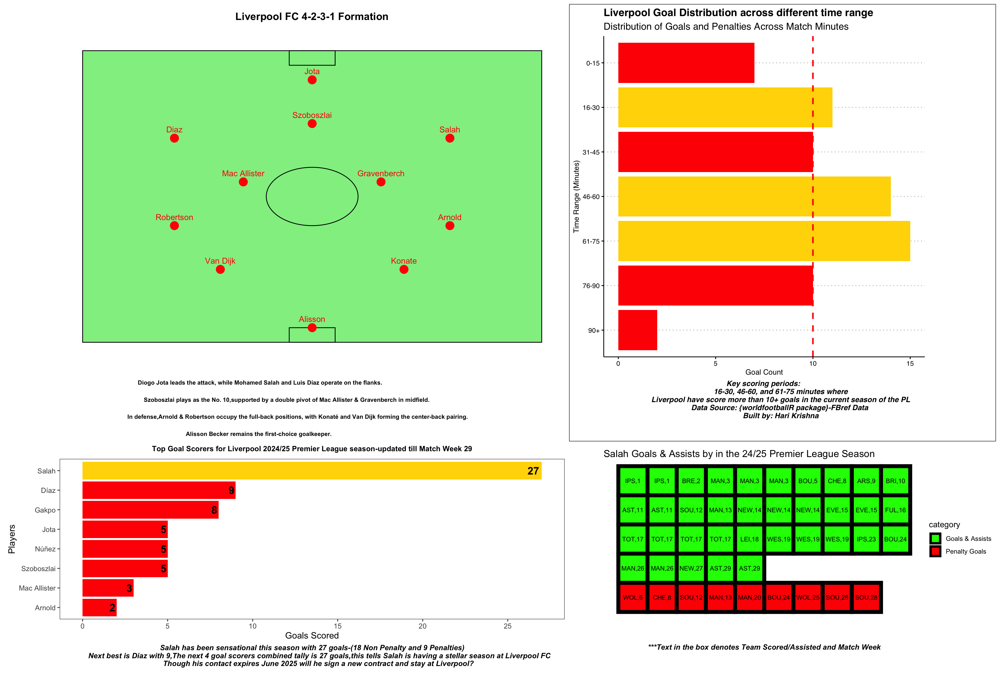

**Liverpool's Dominance in the Premier League 2024-25: A Look at the Numbers**

As the leagues across Europe resume after the international break let us visualize some of Liverpool team amazing stats

Despite their Champions League exit at the hands of PSG and a tough EFL Cup final defeat to Newcastle at Wembley, Liverpool have been nothing short of sensational in the Premier League this season. Sitting at the top of the table with 70 points, they continue to impress.

Here are some key numbers from their campaign so far (data sourced via {worldfootballR} from FBref):

**🔴 Tactical Setup:** Liverpool have predominantly lined up in a 4-2-3-1 formation.

**⚽ Mohamed Salah’s Brilliance:** The Egyptian King has delivered 44 goal contributions this season (27 goals & 17 assists), proving once again why he's world-class.

**⏳ Strong Finishers:** Liverpool tend to score most of their goals in the second half of matches.

**🏟️ Near-Perfect Record:** Their only Premier League loss this season came against Nottingham Forest at Anfield. A remarkable season so far—can they go all the way? 🏆🔴

#### **Note: Graphs are updated only till MatchWeek 29**

1.  Liverpool Formations

2.  Goals scored by Time Ranges

3.  Top Goal scorers in 2024/25 season

4.  Salah scoring by Team/Match Week

