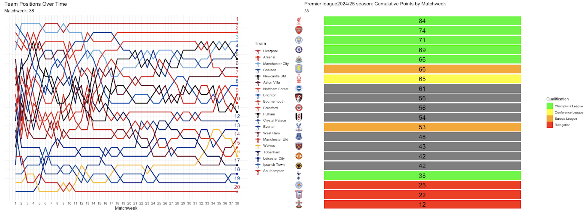
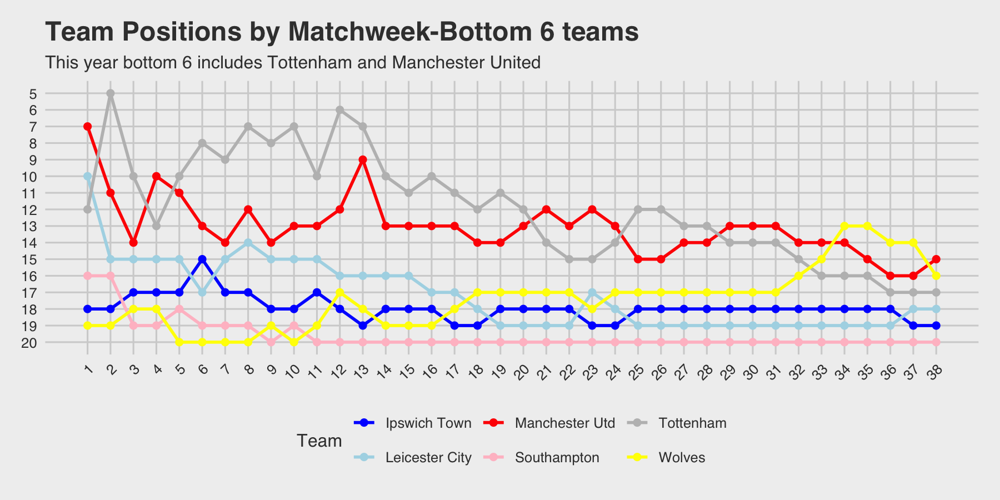

🎥 Premier League 2024/25 – Animated Season Recap with gganimate\
\
I've always been fascinated by how broadcasters present match previews — animated league tables, tactical formations, dramatic progressions across matchweeks. So I decided to bring that experience into R using gganimate.\
\
📊 Presenting the team positions across all 38 matchweeks, complete with key highlights and movements:\
🏆 Arne Slot wins the Premier League title in his first season as Liverpool manager — a historic start.\
⚔️ Arsenal finish 2nd for the third consecutive season. Consistently close, but not quite there yet.\
🔄 Tottenham pull off the unthinkable — finishing 17th in the league but securing Champions League football by winning the Europa League!\
📉 All three promoted sides — Southampton, Leicester, and Ipswich — head back down to the Championship.\
🔝 Liverpool, Chelsea, Arsenal, Newcastle, Man City, and Tottenham will represent the PL in the Champions League next season.\
🔁 And while the dust settles, the transfer market is already buzzing:\
Liam Delap to Chelsea\
Top talents heading to Liverpool\
⚽ August can’t come soon enough. PL 2025/26 is going to be 🔥.\
Data meets drama — just how we like it.\
📈 Built in R using ggplot2 + gganimate + magick .

PL Match week-final day

## Let's also visualize how Tottenham  and Manchester United struggles in the PL this season

-   Both Tottenham and Manchester United have endured disappointing seasons in the Premier League, racking up a combined total of 40 losses.

-   Tottenham recorded 22 defeats—their worst-ever Premier League campaign—but still managed to qualify for the Champions League after edging Manchester United 1-0 in the Europa League final in Bilbao.

-   United, on the other hand, will miss out on European football altogether next season.

-   Had the relegated teams—Ipswich, Southampton, and Leicester—been just a bit stronger and picked up more points, we might have seen Spurs and United dragged into a relegation scrap.

-   With Ange Postecoglou sacked as Spurs manager, questions loom over whether Tottenham can cope with the pressure of Champions League football. Meanwhile, all eyes will be on whether Manchester United can return to their best under new manager Rúben Amorim.

One thing’s for sure: next season is going to be fascinating. Let’s wait and watch.

