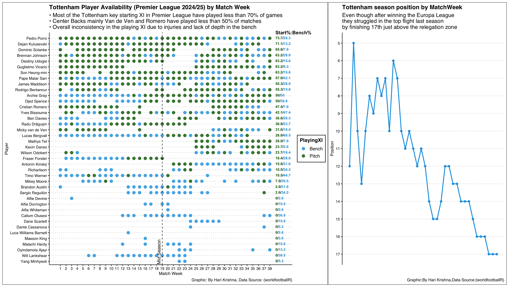

### Tottenham Hotspur 2024/25: A Season of Contrasts

\
Tottenham endured a forgettable Premier League campaign in 2024/25, finishing **17th**—just above the relegation zone.

So, what exactly went wrong?

-   **Injuries at the wrong time** – Key players were sidelined at different stages, disrupting rhythm and consistency.

-   **Fragile defense** – The first-choice centre-back pairing of **Micky van de Ven** and **Cristian Romero** managed to play together in only around half of the games.

-   **Lack of squad depth** – Beyond the starting XI, Spurs lacked quality reinforcements.

-   **Few consistent performers** – Only **Pedro Porro** and **Dejan Kulusevski** featured in more than 70% of league matches (27+ starts across 38 games).

In stark contrast, clubs like **Liverpool, Arsenal, and Manchester City** have built their success on continuity—keeping their core squads intact and their key players fit across the season.

### The Data Visualization

-   **Left chart**: Each dot represents whether a Tottenham player started or was benched in a particular matchweek (1–38). It highlights the instability and rotation forced by injuries.

-   **Right chart**: Spurs’ league position across the season, ultimately ending in **17th place**.

Yet, amid the domestic struggles came a silver lining. Tottenham lifted the **Europa League trophy**—their first major silverware in **17 years**—securing automatic qualification for the **2025/26 Champions League**.

Now, under **Thomas Frank**, Spurs face a fascinating challenge: Can they rebuild consistency in the league while competing on Europe’s biggest stage?
