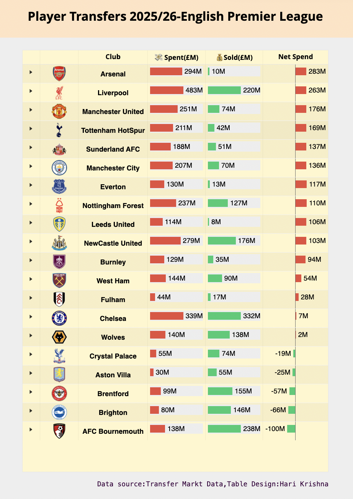

This project is my submission to the Posit Table Contest. It presents an data exploration of all incoming and outgoing player transfers in the **English Premier League (2025/26 season).** The goal is to highlight spending trends, signings(incoming & Outgoing), and club-level comparisons, all in a clean and format.

✨ **Features**\
📊 Interactive Reactable Table displaying transfers club by club\
🔎 Sorting, filtering, and searching for quick exploration\
💰 Fee normalization: values like 12m, 250k, Free, Loan, and End of loan are standardized\
🟥🟩 Conditional formatting to highlight overspending vs. value signings\
📈 Custom calculated metrics such as:

-   Net spend

-   Overpaid % (Fee vs. Market Value)

Packages used for tables: reactable,reactablefmtr

Published using **rPubs**

[Click to view the project](https://rpubs.com/hari_k/PL_Transfers-Final)

### **Code repository**

<https://github.com/harikrishna19/Posit-Table-Contest-2025>

