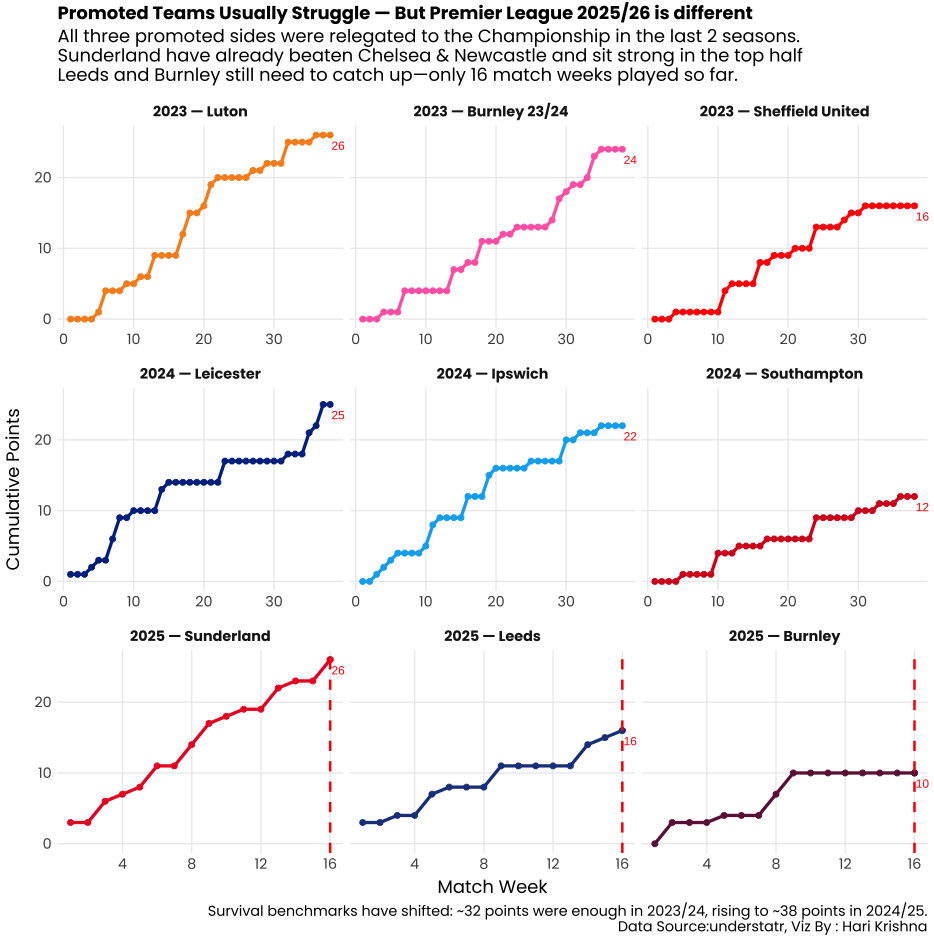

⚽ Promoted Teams in the Premier League 2025/26: Survival Challenge! 🏟️ As the festive season unfolds, newly promoted teams are showing mixed fortunes. Historically, they’ve struggled—last two seasons, all three went straight back down ⬇️ to the Championship.

This season(Only 16 Match weeks Played):

Sunderland – 26 pts ⚡

Leeds – 16 pts 🔹

Burnley – 10 pts 🔸

Every point matters! Can any of these sides ⚽ defy the odds and stay up, or will history repeat itself? 🔥

