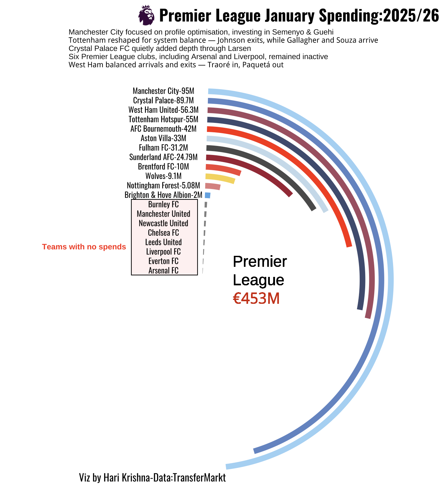

There’s always a special kind of excitement when January arrives in European football. The winter transfer window swings open, and suddenly the game isn’t just played on the pitch — it’s played in boardrooms, scouting departments, and negotiation tables across the continent.

Nowhere is that drama more captivating than in the Premier League. Widely regarded as the most competitive league in the world, January becomes a strategic battlefield — a time for bold reinforcements, smart adjustments, and sometimes desperate gambles.

The stacked radial bar chart below captures this mid-season story in numbers, visualizing how clubs invested during the January transfer window. Beyond the headlines and rumors, it reveals the scale, intent, and ambition behind each club’s spending decisions.

